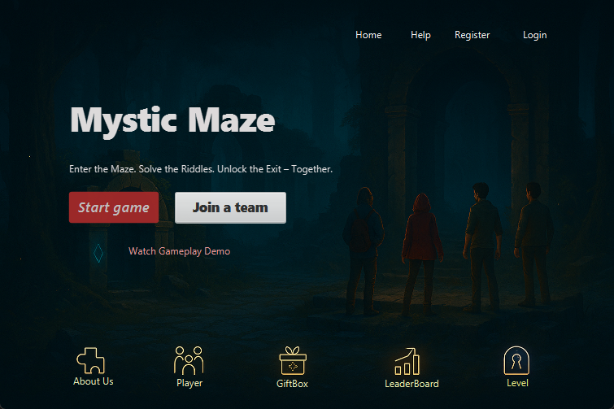

# 🧩 Mystic Maze: Team Puzzle Solving Game

> *Enter the Maze. Solve the Riddles. Unlock the Exit — Together.*

Mystic Maze is a 2D team puzzle game built with **JavaFX** and **MySQL** for the Advanced Object-Oriented Programming (AOOP) course at United International University. Players create accounts, form a team, and work through levels of riddles and logic puzzles, earning rewards and climbing a leaderboard.

🏆 **6th Runner-Up, UIU Software Project Competition (Spring 2025)**



## ✨ Features

- **Accounts:** register and log in; passwords are stored as SHA-256 hashes, never in plain text.
- **Home & dashboard:** start a game or join a team from the landing screen.
- **Levels:** a level-select screen for progressively harder puzzles.
- **Players:** view player profiles and progress.
- **Gift box:** open rewards earned by solving puzzles.
- **Leaderboard:** ranks players and teams.
- **Help & About Us:** how to play, and the team behind the game.

The full game design (2–4 player rooms, per-player puzzles, hint sharing and power-ups) is in [`description.pdf`](description.pdf). The MySQL schema (`users`, `rooms`, `room_members`, `puzzles`, `puzzle_hints`, `player_progress`, `rewards`, `leaderboard`, `game_sessions`) is designed to support it.

## 🛠️ Tech stack

| Part | Technology |
|---|---|
| UI & game screens | JavaFX 17, FXML (Scene Builder) |
| Language | Java 24 (modular, `module-info.java`) |
| Database | MySQL / MariaDB via JDBC (`mysql-connector-j`) |
| Build | Maven (wrapper included) |

## 🚀 Getting started

### Prerequisites

- **JDK 24 or newer** (the project targets Java 24)
- **MySQL 8+** or **MariaDB 10.6+** running locally

### 1. Create the database

```bash
mysql -u root -p -e "CREATE DATABASE mysticmaze"
mysql -u root -p mysticmaze < MysticMaze/MysticMaze/src/main/resources/com/example/mysticmaze/SQL/mysticmaze.sql
```

### 2. Configure the connection (optional)

By default the game connects to `jdbc:mysql://localhost:3306/mysticmaze` as `root` with an empty password. To use different settings, set these environment variables before running:

```bash
export MYSTICMAZE_DB_URL="jdbc:mysql://localhost:3306/mysticmaze"
export MYSTICMAZE_DB_USER="root"
export MYSTICMAZE_DB_PASSWORD="your-password"
```

(On Windows PowerShell use `$env:MYSTICMAZE_DB_PASSWORD = "your-password"`.)

### 3. Run the game

```bash
cd MysticMaze/MysticMaze
./mvnw clean javafx:run        # Windows: mvnw.cmd clean javafx:run
```

## 📁 Project structure

```text
MysticMaze/MysticMaze/
├── pom.xml
└── src/main/
    ├── java/
    │   ├── module-info.java
    │   └── com/example/mysticmaze/
    │       ├── Main.java            # JavaFX entry point
    │       ├── controllers/         # one controller per screen
    │       ├── models/              # User and other data classes
    │       └── utils/DBUtil.java    # JDBC connection + password hashing
    └── resources/com/example/mysticmaze/
        ├── fxmls/                   # screen layouts (Home, Login, Level, LeaderBoard, ...)
        ├── images/                  # characters, backgrounds, gift boxes
        └── SQL/mysticmaze.sql       # database schema
```

## 👥 Team

Built as a team project for the AOOP course at United International University. This repository is [Salah Uddin Selim](https://github.com/salahuddinselim)'s fork of [afiatasnimria/PuzzleSolving-Game](https://github.com/afiatasnimria/PuzzleSolving-Game).
